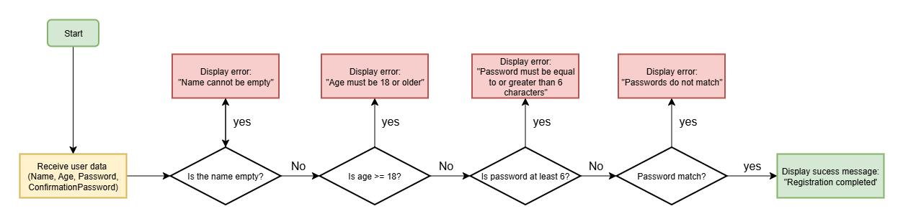

## User Registration Validator

### Description

A practical exercise developed as part of the **Bootcamp Backend .NET + AI** training program.  
Focuses on applying **conditional statements** and **nested ifs** by simulating a user registration process with basic input validation.

### Validation Rules

1. Name cannot be empty.
2. Age must be 18 years or older.
3. Password must contain at least 6 characters.
4. Password and confirmation must match.

### Example Execution

### Input

```text
Name: John
Age: 20
Password: 123456
Confirm Password: 123456
```

### Output

```text
Registration completed
```

### Diagram

### Project diagram

The diagram below illustrates the validation flow of the registration process.


